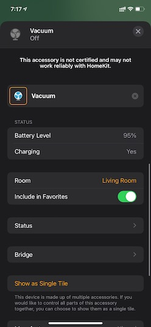

## What's here
### miio-relay

Exposes robot control commands as HTTP API. Mainly a relay server for `python-miio`.

### homebridge-plugin

A Homebridge plugin to control Xiaomi STYJ02YM robot vacuum. Modeled as a fan (pause/resume/suction grade) and a button (return to dock). Mopping controls to be added later.

Communications with the robots are via the `miio-relay` server, because `python-miio` seems to be better-maintained than JS miio libraries.

### TODO
- [ ] Mopping control
- [ ] Alexa integration

### Screenshots

